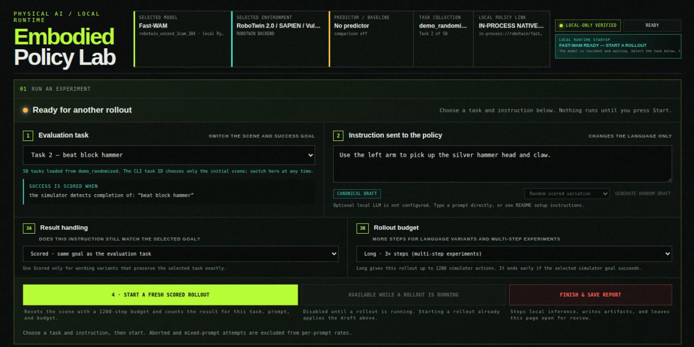
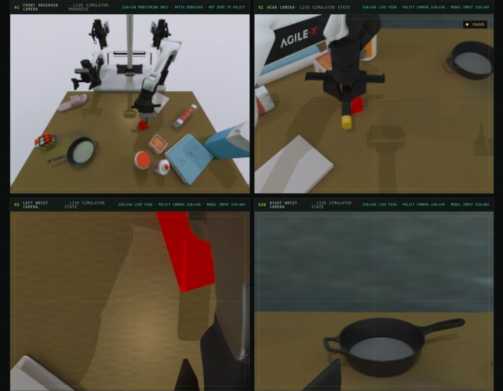
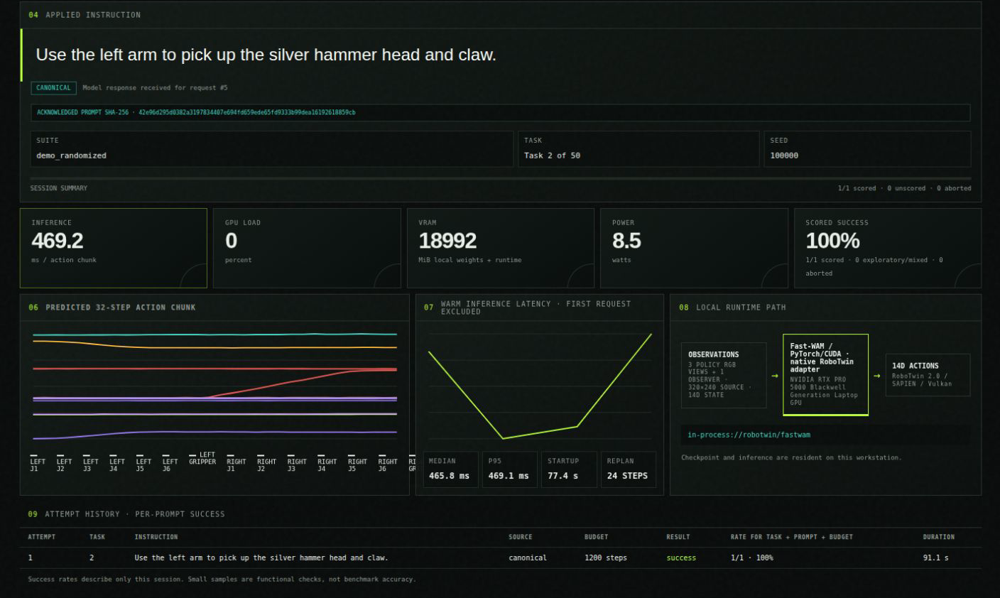
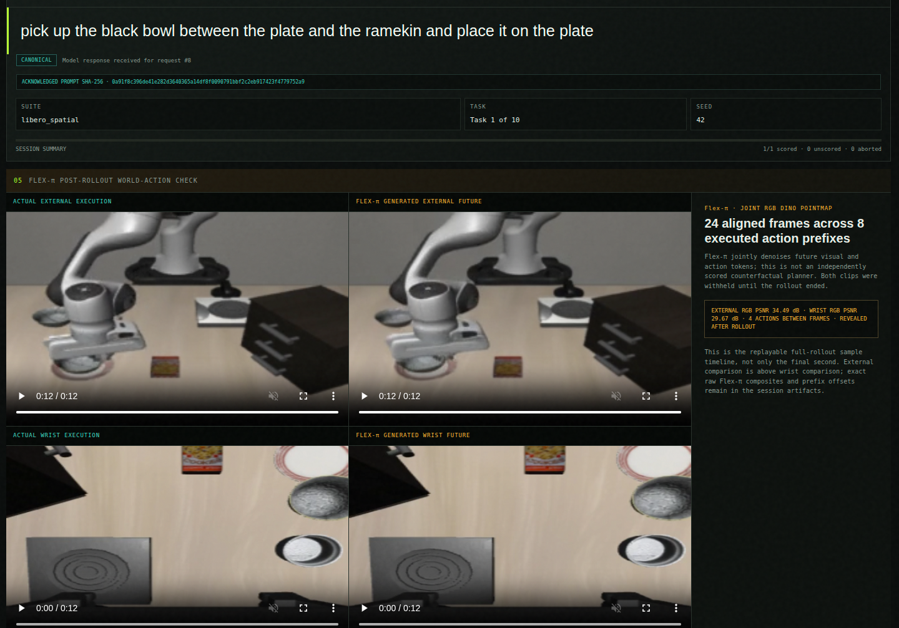
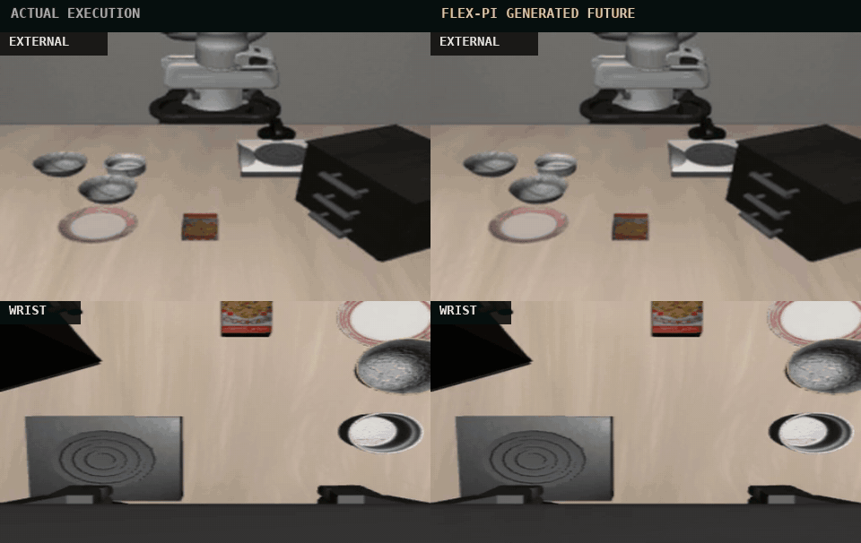
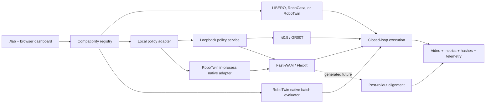

<div align="center">

# Embodied Policy Lab

**Run the policy. See the future it predicted. Compare it with what actually happened.**

Embodied Policy Lab is a local evaluation and observability studio for robot
VLAs and world-action models. Run π0.5, GR00T, Fast-WAM, and Flex-π through one
experiment boundary, then keep the prediction replays, actions, metrics,
prompts, and provenance needed to understand the result. Prediction replays
are retained when the selected model exposes a generated future.

[](https://github.com/robodreamer/embodied-policy-lab/actions/workflows/ci.yml)
[](LICENSE)


[Quick start](#quick-start) · [Model matrix](#model-matrix) ·
[World-action replay](#see-the-future-next-to-the-rollout) ·
[Benchmarks](#matched-wam-benchmark) · [Documentation](#documentation)

</div>

<p align="center">
  
</p>

<p align="center"><sub>
The complete local studio: choose a compatible policy and simulator, define the
scored rollout, select the Flex-π inference regime, and inspect runtime state.
</sub></p>

## Why this lab is different

The community already has strong model implementations, training libraries,
simulators, and leaderboards. Embodied Policy Lab sits between them as the
local experiment and evidence layer:

- **Match unlike models fairly.** Compatible VLA and WAM profiles share the
  same task, seed, rollout budget, dashboard, and result schema.
- **Compare prediction with reality.** Flex-π external and wrist futures are
  aligned with the action prefixes actually executed and revealed only after
  the rollout finishes.
- **Keep evidence, not just a demo.** Every attempt preserves prompts, action
  hashes, latency, GPU telemetry, simulator video, source revisions, and
  success state.
- **Run locally and audit the boundary.** Policy inference, simulation, prompt
  generation, and telemetry stay on the workstation; observed network
  destinations are recorded.
- **Respect upstream contracts.** Heavy models stay in pinned, independent
  runtimes instead of being forced through one lossy preprocessing path.

Upstream projects remain authoritative for training and model claims. This lab
owns the repeatable workflow for asking a different question: **what did this
model predict, what did the robot actually do, and what evidence supports the
comparison?** Read the [public roadmap](ROADMAP.md) for the competitive boundary
and next priorities.

This is a research workbench, not a robot-safety system or a claim that unlike
papers have been reproduced under identical conditions.

### When is future imagination worth it?

The current WAM experiment compares Fast-WAM's direct action path with Flex-π
in action-only and full-joint world-action modes under a shared local LIBERO
schedule. That makes the speed, memory, control, and visible-prediction
tradeoffs inspectable without confusing publisher results with local evidence.

## Model matrix

| Family | Model | Output used by the lab | Simulator | Status |
|---|---|---|---|---|
| VLA | π0.5 | action chunks | LIBERO, RoboCasa | supported |
| VLA | NVIDIA Isaac GR00T N1.5 | action chunks | RoboCasa | supported |
| WAM | Fast-WAM | 32×7 EEF or 32×14 qpos action chunks | LIBERO, RoboTwin 2.0 | experimental; RoboTwin studio + native batch |
| WAM | Flex-π action-only | 32×7 EEF or 32×14 qpos action chunks | LIBERO, RoboTwin 2.0 | experimental; RoboTwin studio + native batch |
| WAM | Flex-π full-joint | actions + RGB/DINO/pointmap futures | LIBERO, RoboTwin 2.0 | experimental; default Flex-π mode; RoboTwin studio + native batch |

RoboCasa also exposes `robocasa-sim`, an optional deterministic simulator-oracle
baseline. It replays action prefixes in a matched MuJoCo environment; it is not
a learned world model. Unsupported model/simulator pairs never appear in the
picker. See the [plugin contract](docs/model-plugins.md) and
[world-model guide](docs/world-model-plugins.md).

## Quick start

Embodied Policy Lab currently targets Ubuntu with an NVIDIA GPU. CPU-only
tests work without checkpoints, but model rollouts do not.

```bash
git clone --recurse-submodules \
  https://github.com/robodreamer/embodied-policy-lab.git
cd embodied-policy-lab

# Inspect every supported combination before downloading a model.
./lab --list
```

For the shortest interactive path, install RoboCasa assets and the π0.5
checkpoint once, then open the terminal picker:

```bash
ROBOCASA_DOWNLOAD_ASSETS=1 ROBOCASA_DOWNLOAD_CHECKPOINT=1 \
  ./scripts/setup_robocasa.sh
./lab --default
```

The dashboard opens at <http://127.0.0.1:8085>. Select a task, review the exact
instruction and rollout budget, then start the attempt. Generated artifacts are
written under `showcase-runs/<timestamp>/`.

### Pick another experiment

| Goal | One-time setup | Launch |
|---|---|---|
| π0.5 on LIBERO | `./scripts/setup.sh` | `./lab --backend libero --model pi05` |
| Fast-WAM on LIBERO | `./scripts/setup_fastwam_libero.sh` | `./lab --backend libero --model fastwam` |
| Flex-π world + action | `./scripts/setup_flexpi_libero.sh` | `./lab --backend libero --model flexpi` |
| Flex-π action-only | same as above | `./lab --backend libero --model flexpi --flexpi-mode action-only` |
| GR00T N1.5 on RoboCasa | `ROBOCASA_DOWNLOAD_ASSETS=1 GROOT_DOWNLOAD_CHECKPOINT=1 ./scripts/setup_groot.sh` | `./lab --backend robocasa --model groot-n1.5` |
| Fast-WAM on RoboTwin | `./scripts/setup_robotwin.sh --model fastwam --download-assets --download-checkpoints` | `./lab --backend robotwin --model fastwam --mode interactive --default` |
| Flex-π on RoboTwin | `./scripts/setup_robotwin.sh --model flexpi --download-assets --download-checkpoints` | `./lab --backend robotwin --model flexpi --mode interactive --default` |

The Fast-WAM and Flex-π setup scripts clone revision-checked sibling
repositories and verify published assets. Re-run either with `--check` for a
non-mutating readiness check. Downloads are large; see
[hardware and storage](#hardware-and-storage) before starting.

<details>
<summary><strong>Useful picker commands</strong></summary>

```bash
./lab                                  # fzf picker, or numbered fallback
./lab --policy-family vla              # only VLA profiles
./lab --policy-family wam              # Fast-WAM or Flex-π
./lab --backend robotwin --model flexpi --mode interactive --default
./lab --backend robocasa               # fill the remaining choices interactively
./lab --default --dry-run              # print the default command without running it
```

</details>

RoboTwin interactive sessions preserve its native head, left-wrist, and
right-wrist views and 14D qpos action contract. Select any of the 50 named
tasks in the browser; for Flex-π, switch between world-action co-generation
and action-only inference without loading another checkpoint. Choose
`--mode batch` for the model publisher's native evaluation/reporting path.

## One dashboard, comparable evidence

The studio keeps experiment setup, live simulator state, model inputs,
post-rollout comparisons, and system telemetry in one reviewable session.
External and wrist cameras stay visible while the policy runs; generated
futures are withheld until execution finishes.

<p align="center">
  
</p>

<p align="center"><sub>
Live external and wrist views, camera and model-input dimensions, the applied
instruction, task suite, task ID, and seed remain visible together.
</sub></p>

<table>
<tr>
<td width="48%" valign="top">

**Execute a policy**

The live dashboard keeps external and wrist cameras, exact language command,
action-chunk shape, task progress, success state, latency, and GPU telemetry in
one place.

</td>
<td width="52%" align="center">
  
</td>
</tr>
</table>

The example above is a locally validated π0.5 rollout that places both moka
pots on the stove. The lab also supports prompt variants, live instruction
updates, unscored exploratory commands, and an optional loopback-only local
prompt generator.

<p align="center">
  
</p>

<p align="center"><sub>
The lower studio turns a rollout into evidence: predicted action channels,
warm latency, startup time, replay cadence, GPU telemetry, runtime path, and
per-prompt result history.
</sub></p>

After each attempt, review:

```text
showcase-runs/<session>/
├── report.md + summary.json        # portable result and rollup
├── state.json                    # dashboard state and latency samples
├── inference-audit.jsonl         # prompts, hashes, steps, timing
├── gpu.csv                       # one-second NVIDIA telemetry
├── videos/*.mp4                  # executed simulator rollouts
├── previews/                     # aligned prediction/actual media
└── network-*.log                 # observed network syscall evidence
```

```bash
./scripts/view_latest_showcase.sh
./scripts/build_montage.sh
```

### See the future next to the rollout

Flex-π defaults to full-joint world-action co-generation. Its RGB, DINO,
pointmap, and end-effector action futures come from the same denoising pass.
Matched actual frames are collected silently during execution, then both
external and wrist comparisons appear below the live views when the rollout is
complete.

<p align="center">
  
</p>

<p align="center"><sub>
Completed Flex-π rollout with the actual/generated external pair above the
actual/generated wrist pair. The panel reports 24 aligned frames across eight
executed action prefixes for this run.
</sub></p>

<p align="center">
  
</p>

This is a temporal diagnostic, not a counterfactual planner: the generated
future does not score candidate actions or change the completed rollout. The
[Flex-π validation note](docs/validation/flexpi-libero.md)
documents the camera, depth, action-space, and release-asset contracts.

## Matched WAM benchmark

The headless runner evaluates Fast-WAM action-only, Flex-π action-only, and
Flex-π full-joint under a shared local LIBERO task/seed/budget schedule. It
records closed-loop success, Wilson intervals, warm latency, peak GPU memory,
and one auditable session per configuration.

```bash
./scripts/benchmark_wam_libero.py --profile smoke      # wiring only
./scripts/benchmark_wam_libero.py --profile pilot      # provisional estimate
./scripts/benchmark_wam_libero.py --profile paper      # 6,000 episodes
./scripts/benchmark_wam_libero.py --profile paper --plan-only
```

Results land under `benchmark-runs/wam-libero-*/`. The `paper` profile is a
matched **local** comparison; it is not a reproduction of either project's
complete paper protocol. Read the
[benchmark protocol and claim boundaries](docs/benchmarks/fastwam-flexpi-libero.md).

## How it fits together



Each profile translates the simulator's canonical observations into the exact
camera, state, prompt, and action representation expected by its released
checkpoint. Profile-specific preprocessing is deliberately preserved; forcing
one universal transform would make the comparison less faithful, not more.

## Hardware and storage

The currently validated local profile is Ubuntu on a 24 GB NVIDIA RTX PRO 5000.
Treat the figures below as planning guidance, not minimum guarantees.

| Resource | Observed / expected footprint |
|---|---:|
| π0.5 inference checkpoint | ~12 GB download |
| First LIBERO/OpenPI cache | ~11.6 GiB |
| RoboCasa assets | ~23 GB |
| RoboTwin assets | ~16 GB, shared by the isolated Fast-WAM/Flex-π runtimes |
| GR00T N1.5 inference checkpoint | ~7.6 GB |
| Flex-π release checkpoint | ~12 GB, plus VAE/T5/DINO assets |
| Fast-WAM RoboTwin release checkpoint | ~12 GB |
| Flex-π action-only peak reservation | 13.24 GiB in the bounded local check |
| Flex-π full-joint peak reservation | 16.45 GiB in the bounded local check |

Large policies run one at a time. The launcher reserves the policy GPU before
starting optional prompt generation and rejects accidental concurrent lab
sessions unless explicitly overridden. Exact setup, environment variables,
camera presentation controls, and troubleshooting live in the
[operator guide](docs/operator-guide.md).

## Documentation

| Document | Use it for |
|---|---|
| [Operator guide](docs/operator-guide.md) | complete setup, dashboard workflow, runtime flags, artifacts, troubleshooting |
| [Model plugins](docs/model-plugins.md) | adding a policy without coupling it to a simulator |
| [World-model plugins](docs/world-model-plugins.md) | predictor semantics and the RoboCasa simulator-oracle baseline |
| [External assets](docs/external-assets.md) | source/weight licenses, pinned revisions, integrity checks |
| [Roadmap](ROADMAP.md) | public priorities, scope boundaries, and research direction |
| [π0.5 RoboCasa validation](docs/validation/robocasa-pi05.md) | observation/action contract and bounded local evidence |
| [GR00T N1.5 RoboCasa validation](docs/validation/groot-n1.5-robocasa.md) | pinned integration and bounded local evidence |
| [Fast-WAM validation](docs/validation/fastwam-libero.md) | released-checkpoint boundary and bounded experiment |
| [Flex-π validation](docs/validation/flexpi-libero.md) | full-joint implementation and measured local checks |
| [RoboTwin integration](docs/validation/robotwin-foundation.md) | 14D bimanual contract, three-camera studio, model-free smoke, and native batch path |
| [WAM benchmark](docs/benchmarks/fastwam-flexpi-libero.md) | headless protocol, provenance, and claims |
| [Results](results/README.md) | sanitized publishable validation summaries |

## Development

The default test suite is CPU-safe and does not download checkpoints:

```bash
python -m pip install -r requirements-test.txt
python -m pytest -q
tests/test_lab_cli.sh
bash -n bin/embodied-lab scripts/*.sh tests/*.sh
```

Contributions are welcome. Start with [CONTRIBUTING.md](CONTRIBUTING.md), and
include the source revision, checkpoint identity, hardware, task IDs, seeds,
and trial count for any new empirical claim. Please use
[GitHub Security Advisories](SECURITY.md) for vulnerabilities rather than a
public issue.

## License and upstream projects

Lab-authored code is licensed under [Apache-2.0](LICENSE); see [NOTICE](NOTICE).
Pinned submodules, sibling repositories, simulator assets, and model weights
retain their own licenses and terms. Embodied Policy Lab does not redistribute
weights. Review [external asset licensing](docs/external-assets.md) before
redistributing any downloaded artifact.

This workbench integrates or evaluates projects from
[Physical Intelligence OpenPI](https://github.com/Physical-Intelligence/openpi),
[RoboCasa](https://github.com/robocasa/robocasa),
[NVIDIA Isaac GR00T](https://github.com/NVIDIA/Isaac-GR00T),
[Fast-WAM](https://github.com/yuantianyuan01/FastWAM),
[Flex-π](https://github.com/geyan21/flex-pi),
[LIBERO](https://github.com/Lifelong-Robot-Learning/LIBERO), and
[RoboTwin](https://github.com/RoboTwin-Platform/RoboTwin). Their papers,
checkpoints, and repositories remain the authoritative sources for model
claims.

If you use the lab in research, cite this software with
[`CITATION.cff`](CITATION.cff) and cite each model and benchmark you evaluate.
