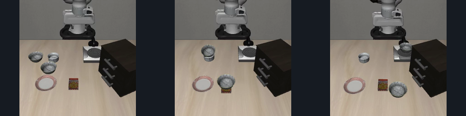
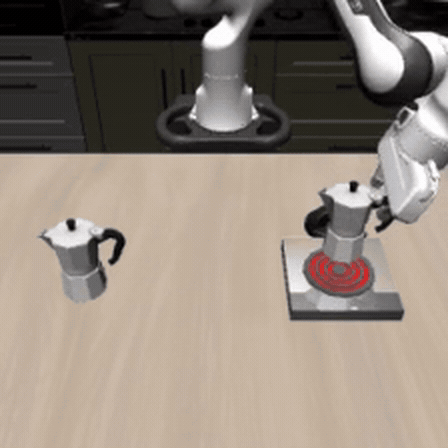
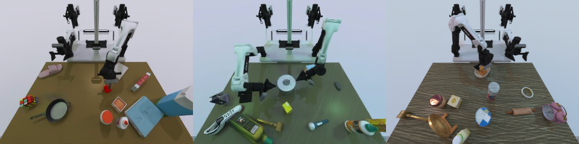
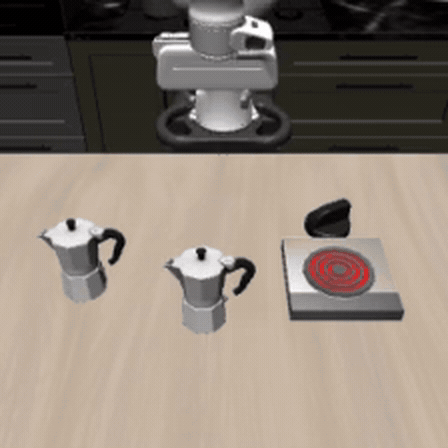
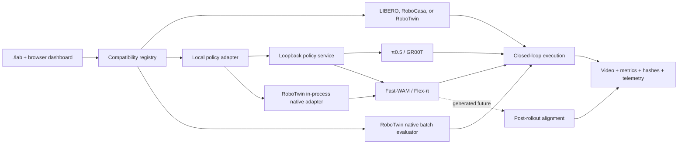

<div align="center">

# Embodied Policy Lab

**Run the policy. See the future it predicted. Compare it with what actually happened.**

Embodied Policy Lab is a local studio for robot vision-language-action (VLA)
and world-action (WAM) models. It runs released checkpoints in simulators,
shows the live rollout, and stores the prompts, actions, videos, metrics, and
provenance from each attempt. When a model also generates a future, that
prediction is kept and shown next to the executed rollout.

[](https://github.com/robodreamer/embodied-policy-lab/actions/workflows/ci.yml)
[](LICENSE)
[](https://github.com/robodreamer/embodied-policy-lab/releases)


[Overview](#overview) · [Quick start](#quick-start) · [Models](#model-matrix) ·
[Environments](#environments-at-a-glance) ·
[World-action replay](#see-the-future-next-to-the-rollout) ·
[Benchmarks](#matched-wam-benchmark) · [Changelog](CHANGELOG.md) ·
[Documentation](#documentation)

</div>

<p align="center">
  
</p>

<p align="center"><sub>
Studio after a Fast-WAM RoboTwin run: choose a task, review the scored
rollout contract, and inspect the local runtime.
</sub></p>

## Overview

The lab is a local evaluation and observability layer around released robot
policies. A session typically looks like this:

1. Choose a compatible model and simulator.
2. Run a closed-loop task with a declared seed and action budget.
3. Watch the live cameras, instruction, actions, latency, and success state.
4. After the attempt, review saved artifacts — and, when the model produces
   them, aligned prediction-versus-execution replays.

Compatible VLA and WAM profiles share the same launcher, dashboard, and result
schema. Each profile keeps the cameras, state ordering, image transforms, and
action contract of its released checkpoint. Heavy models run in pinned,
isolated runtimes, one large policy at a time.

Current models are π0.5, NVIDIA Isaac GR00T N1.5, Fast-WAM, and Flex-π.
Simulators are LIBERO, RoboCasa, and RoboTwin 2.0. Upstream repositories remain
the source for training, architecture, and publisher benchmark claims. See the
[roadmap](ROADMAP.md) for current priorities.

## Model matrix

| Family | Model | Output used by the lab | Simulator | Status |
|---|---|---|---|---|
| VLA | π0.5 | action chunks | LIBERO, RoboCasa | supported |
| VLA | NVIDIA Isaac GR00T N1.5 | action chunks | RoboCasa | supported |
| WAM | Fast-WAM | 32×7 EEF or 32×14 qpos action chunks | LIBERO, RoboTwin 2.0 | experimental; RoboTwin studio + native batch |
| WAM | Flex-π action-only | 32×7 EEF or 32×14 qpos action chunks | LIBERO, RoboTwin 2.0 | experimental; RoboTwin studio + native batch |
| WAM | Flex-π full-joint | 32×7 EEF actions + RGB/DINO/pointmap futures | LIBERO | experimental; default Flex-π mode |
| WAM | Flex-π full-joint | 32×14 qpos actions; future media not yet retained by the studio | RoboTwin 2.0 | experimental; studio + native batch |

RoboCasa also exposes `robocasa-sim`, an optional deterministic simulator-oracle
baseline. It replays action prefixes in a matched MuJoCo environment; it is not
a learned world model. Unsupported model/simulator pairs never appear in the
picker. See the [plugin contract](docs/model-plugins.md) and
[world-model guide](docs/world-model-plugins.md).

Generated-future media is decoded and retained for Flex-π on LIBERO. RoboTwin
full-joint mode runs the released joint-denoising path; the studio keeps the
three-camera rollout and 14D action chunks.

## Environments at a glance

The lab preserves each simulator's native camera and action contracts while
standardizing how runs are launched, observed, and saved. Each strip below
uses that simulator's front/external observer view and shows three task
scenes at the same 960×240 size. Frames are chosen for scene legibility, not
rollout-time alignment.

<table>
  <tr>
    <th>LIBERO / robosuite / MuJoCo</th>
  </tr>
  <tr>
    <td align="center">
      
    </td>
  </tr>
  <tr>
    <td><sub>Left to right: bowl between plate and ramekin · bowl on ramekin · bowl beside cookie box.</sub></td>
  </tr>
  <tr>
    <th>RoboCasa365 / robosuite / MuJoCo</th>
  </tr>
  <tr>
    <td align="center">
      
    </td>
  </tr>
  <tr>
    <td><sub>Left to right: close blender lid · close toaster-oven door · turn off rear-left burner.</sub></td>
  </tr>
  <tr>
    <th>RoboTwin 2.0 / SAPIEN / Vulkan</th>
  </tr>
  <tr>
    <td align="center">
      
    </td>
  </tr>
  <tr>
    <td><sub>Left to right: beat block with hammer · lift two-handled pot · place bread in basket.</sub></td>
  </tr>
</table>

## Quick start

Embodied Policy Lab currently targets Ubuntu with an NVIDIA GPU. CPU-only
tests work without checkpoints, but model rollouts do not.

```bash
git clone --recurse-submodules \
  https://github.com/robodreamer/embodied-policy-lab.git
cd embodied-policy-lab

# Inspect every supported combination before downloading a model.
./lab --list
```

For the shortest interactive path, install RoboCasa assets and the π0.5
checkpoint once, then open the terminal picker:

```bash
ROBOCASA_DOWNLOAD_ASSETS=1 ROBOCASA_DOWNLOAD_CHECKPOINT=1 \
  ./scripts/setup_robocasa.sh
./lab --default
```

The dashboard opens at <http://127.0.0.1:8085>. Select a task, review the exact
instruction and rollout budget, then start the attempt. Generated artifacts are
written under `showcase-runs/<timestamp>/`.

### Pick another experiment

| Goal | One-time setup | Launch |
|---|---|---|
| π0.5 on LIBERO | `./scripts/setup.sh` | `./lab --backend libero --model pi05` |
| Fast-WAM on LIBERO | `./scripts/setup_fastwam_libero.sh` | `./lab --backend libero --model fastwam` |
| Flex-π world + action | `./scripts/setup_flexpi_libero.sh` | `./lab --backend libero --model flexpi` |
| Flex-π action-only | same as above | `./lab --backend libero --model flexpi --flexpi-mode action-only` |
| GR00T N1.5 on RoboCasa | `ROBOCASA_DOWNLOAD_ASSETS=1 GROOT_DOWNLOAD_CHECKPOINT=1 ./scripts/setup_groot.sh` | `./lab --backend robocasa --model groot-n1.5` |
| Fast-WAM on RoboTwin | `./scripts/setup_robotwin.sh --model fastwam --download-assets --download-checkpoints` | `./lab --backend robo_twin --model fastwam --mode interactive --default` |
| Flex-π on RoboTwin | `./scripts/setup_robotwin.sh --model flexpi --download-assets --download-checkpoints` | `./lab --backend robo_twin --model flexpi --mode interactive --default` |

The Fast-WAM and Flex-π setup scripts clone revision-checked sibling
repositories and verify published assets. Re-run either with `--check` for a
non-mutating readiness check. Downloads are large; see
[hardware and storage](#hardware-and-storage) before starting.

<details>
<summary><strong>Useful picker commands</strong></summary>

```bash
./lab                                  # fzf picker, or numbered fallback
./lab --policy-family vla              # only VLA profiles
./lab --policy-family wam              # Fast-WAM or Flex-π
./lab --backend robo_twin --list-tasks # inspect all 50 named tasks
./lab --backend robo_twin --model flexpi # choose phase and task interactively
./lab --backend robocasa               # fill the remaining choices interactively
./lab --default --dry-run              # print the default command without running it
```

</details>

RoboTwin interactive sessions preserve its native head, left-wrist, and
right-wrist views and 14D qpos action contract. Select any of the 50 named
tasks in the terminal picker or browser; for Flex-π, switch between
full-joint and action-only inference without loading another checkpoint.
Choose `--mode batch` for the model publisher's native evaluation/reporting
path.

## Dashboard

The studio keeps experiment setup, live simulator state, model inputs,
post-rollout comparisons, and system telemetry in one session. Simulator
cameras stay visible while the policy runs. Generated futures, when the
selected profile produces them, appear after execution finishes.

<p align="center">
  
</p>

<p align="center"><sub>
RoboTwin's monitoring-only front observer and all three policy cameras remain
visible together, with the source and model-input dimensions labeled explicitly.
</sub></p>

<table>
<tr>
<td width="48%" valign="top">

**Execute a policy**

The live dashboard keeps each simulator's available camera views, exact
language command, action-chunk shape, task progress, success state, latency,
and GPU telemetry in one place.

</td>
<td width="52%" align="center">
  
</td>
</tr>
</table>

The clip above is a Fast-WAM LIBERO-10 rollout that places both moka pots on
the stove. The lab also supports prompt variants, live instruction updates,
unscored exploratory commands, and an optional loopback-only local prompt
generator.

<p align="center">
  
</p>

<p align="center"><sub>
The lower studio turns the same completed rollout into evidence: the applied
instruction, 14D action channels, warm latency, startup time, replay cadence,
GPU telemetry, runtime path, and per-prompt result history.
</sub></p>

After each attempt, review:

```text
showcase-runs/<session>/
├── report.md + summary.json      # portable result and rollup
├── state.json                    # dashboard state and latency samples
├── inference-audit.jsonl         # prompts, hashes, steps, timing
├── gpu.csv                       # one-second NVIDIA telemetry
├── videos/*.mp4                  # executed simulator rollouts
├── previews/                     # aligned prediction/actual media
└── network-*.log                 # observed network syscall evidence
```

```bash
./scripts/view_latest_showcase.sh
./scripts/build_montage.sh
```

### See the future next to the rollout

Flex-π defaults to full-joint world-action co-generation. Its RGB, DINO,
pointmap, and end-effector action futures come from the same denoising pass.
Matched actual frames are collected silently during execution, then both
external and wrist comparisons appear below the live views when the rollout is
complete.

<p align="center">
  
</p>

<p align="center"><sub>
Completed Flex-π rollout with the actual/generated external pair above the
actual/generated wrist pair. The panel reports 24 aligned frames across eight
executed action prefixes for this run.
</sub></p>

<p align="center">
  
</p>

The generated future is aligned to the executed action prefixes and does not
change the completed rollout. The
[Flex-π validation note](docs/validation/flexpi-libero.md)
documents the camera, depth, action-space, and release-asset contracts.

## Matched WAM benchmark

The headless runner evaluates Fast-WAM action-only, Flex-π action-only, and
Flex-π full-joint under a shared local LIBERO task/seed/budget schedule. It
records closed-loop success, Wilson intervals, warm latency, peak GPU memory,
and one auditable session per configuration.

```bash
./scripts/benchmark_wam_libero.py --profile smoke      # wiring only
./scripts/benchmark_wam_libero.py --profile pilot      # provisional estimate
./scripts/benchmark_wam_libero.py --profile paper      # 6,000 episodes
./scripts/benchmark_wam_libero.py --profile paper --plan-only
```

Results land under `benchmark-runs/wam-libero-*/`. The `paper` profile is a
matched local schedule of 6,000 episodes. Protocol details, coverage, and
claim labels are in the
[benchmark protocol](docs/benchmarks/fastwam-flexpi-libero.md).

## How it fits together



Each profile translates the simulator's canonical observations into the camera,
state, prompt, and action representation expected by its released checkpoint.

## Hardware and storage

Model rollouts target Ubuntu with an NVIDIA GPU and a current CUDA driver.
CPU-only machines can run the test suite, but not live policy inference.

Plan around **~24 GB of GPU memory** for the larger world-action profiles.
Smaller VLA checkpoints may fit in less VRAM. Peak usage depends on the model,
simulator, and whether generated-future decoding is enabled. Run one large
policy at a time; the launcher reserves the policy GPU and rejects accidental
concurrent lab sessions unless you override it.

Downloads and caches are large. Approximate footprints:

| Resource | Typical footprint |
|---|---:|
| π0.5 inference checkpoint | ~12 GB |
| First LIBERO/OpenPI cache | ~12 GB |
| RoboCasa assets | ~23 GB |
| RoboTwin assets | ~16 GB, shared by the isolated Fast-WAM/Flex-π runtimes |
| GR00T N1.5 inference checkpoint | ~8 GB |
| Flex-π release checkpoint | ~12 GB, plus VAE/T5/DINO assets |
| Fast-WAM RoboTwin release checkpoint | ~12 GB |
| Flex-π action-only peak GPU reservation | ~13 GB |
| Flex-π full-joint peak GPU reservation | ~16 GB |

Exact setup, environment variables, camera controls, and troubleshooting are
in the [operator guide](docs/operator-guide.md).

## Documentation

| Document | Use it for |
|---|---|
| [Changelog](CHANGELOG.md) | released versions and user-visible changes |
| [Operator guide](docs/operator-guide.md) | complete setup, dashboard workflow, runtime flags, artifacts, troubleshooting |
| [Model plugins](docs/model-plugins.md) | adding a policy without coupling it to a simulator |
| [World-model plugins](docs/world-model-plugins.md) | predictor semantics and the RoboCasa simulator-oracle baseline |
| [External assets](docs/external-assets.md) | source/weight licenses, pinned revisions, integrity checks |
| [Roadmap](ROADMAP.md) | public priorities and research direction |
| [π0.5 RoboCasa validation](docs/validation/robocasa-pi05.md) | observation/action contract and bounded local evidence |
| [GR00T N1.5 RoboCasa validation](docs/validation/groot-n1.5-robocasa.md) | pinned integration and bounded local evidence |
| [Fast-WAM validation](docs/validation/fastwam-libero.md) | released-checkpoint boundary and bounded experiment |
| [Flex-π validation](docs/validation/flexpi-libero.md) | full-joint implementation and measured local checks |
| [RoboTwin integration](docs/validation/robotwin-foundation.md) | 14D bimanual contract, three policy cameras plus observer, model-free smoke, and native batch path |
| [WAM benchmark](docs/benchmarks/fastwam-flexpi-libero.md) | headless protocol, provenance, and claims |
| [Results](results/README.md) | sanitized publishable validation summaries |

## Development

The default test suite is CPU-safe and does not download checkpoints:

```bash
python -m pip install -r requirements-test.txt
python -m pytest -q
tests/test_lab_cli.sh
bash -n bin/embodied-lab scripts/*.sh tests/*.sh
```

Contributions are welcome. Start with [CONTRIBUTING.md](CONTRIBUTING.md), and
include the source revision, checkpoint identity, hardware, task IDs, seeds,
and trial count for any new empirical claim. Please use
[GitHub Security Advisories](SECURITY.md) for vulnerabilities rather than a
public issue.

## License and upstream projects

Lab-authored code is licensed under [Apache-2.0](LICENSE); see [NOTICE](NOTICE).
Pinned submodules, sibling repositories, simulator assets, and model weights
retain their own licenses and terms. Embodied Policy Lab does not redistribute
weights. Review [external asset licensing](docs/external-assets.md) before
redistributing any downloaded artifact.

This workbench integrates or evaluates projects from
[Physical Intelligence OpenPI](https://github.com/Physical-Intelligence/openpi),
[RoboCasa](https://github.com/robocasa/robocasa),
[NVIDIA Isaac GR00T](https://github.com/NVIDIA/Isaac-GR00T),
[Fast-WAM](https://github.com/yuantianyuan01/FastWAM),
[Flex-π](https://github.com/geyan21/flex-pi),
[LIBERO](https://github.com/Lifelong-Robot-Learning/LIBERO), and
[RoboTwin](https://github.com/RoboTwin-Platform/RoboTwin). Their papers,
checkpoints, and repositories remain the authoritative sources for model
claims.

If you use the lab in research, cite this software with
[`CITATION.cff`](CITATION.cff) and cite each model and benchmark you evaluate.
